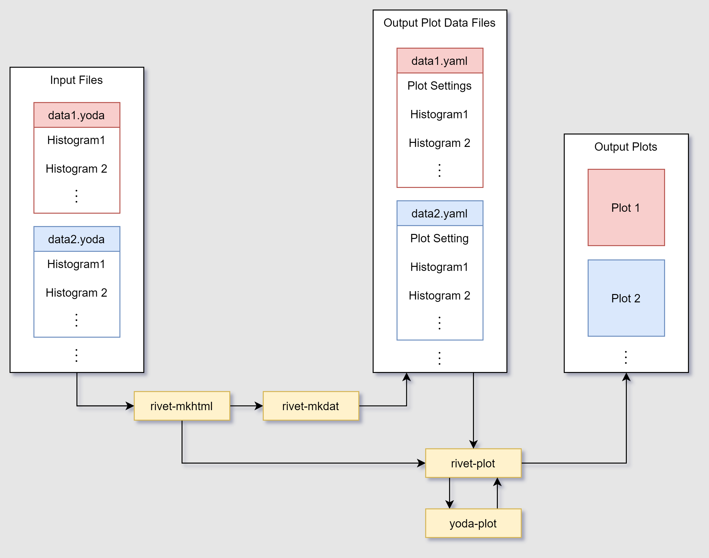
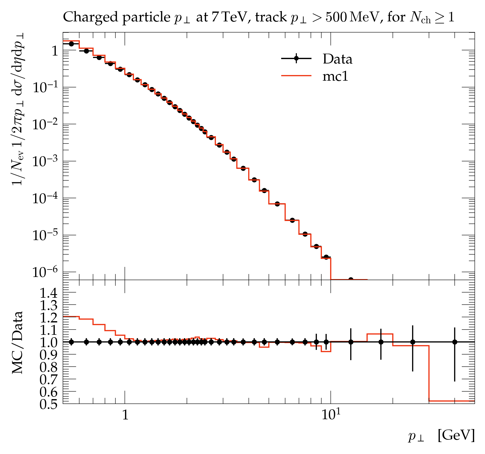
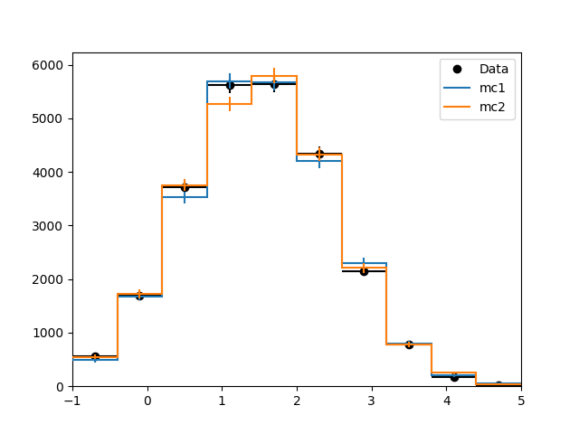
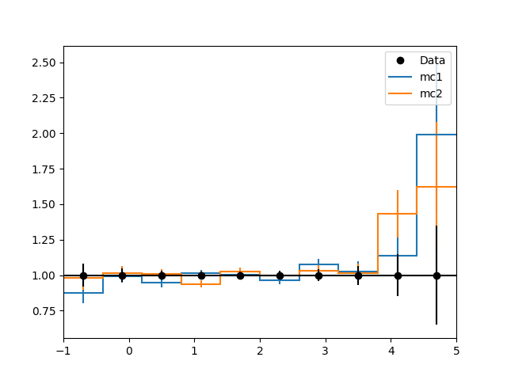

# Google Summer of Code 2021 Final Report - Matthew Filipovich
## Modern Plotting Machinery for the Large Hadron Collider's Monte Carlo Event Analysis Tool

### Organization: [CERN-HSF](https://hepsoftwarefoundation.org/activities/gsoc.html)
### Mentors: Andy Buckley, Christian Bierlich

# Introduction
The [Rivet toolkit](https://rivet.hepforge.org) (Robust Independent Validation of Experiment and Theory) is a software package for performing data analysis on simulated particle collision events like those in the Large Hadron Collider (LHC). Rivet is a system for the preservation of particle-collider analysis logic, analysis reinterpretation via Monte Carlo (MC) simulations, and the validation and improvement of MC event generator codes. Rivet covers all aspects of collider physics and is the LHC's principle tool for model testing using events simulated with MC methods, as there are over 1000 analysis routines registered on the Rivet platform.

Before my Google Summer of Code 2021 project, visualization of Rivet’s output was executed by a set of Python scripts which generated LaTeX PStricks graphics commands to draw the plots. This architecture could be slow and error-prone due to the LaTeX backend and its sensitivities to deployment platforms. My project was to design and implement a replacement for the visualization system using the Matplotlib plotting package while preserving high quality outputs. The goal of the project was to create an intuitive Python plotting package that incorporated a single coherent treatment of the existing classes within the Rivet toolkit.


# Design and Implementation
An overview of the implemented plotting API is shown below, where the user supplies the input files (`data1.yoda`, `data2.yoda`, ...) containing the histogram data (as YODA objects) to be plotted:



The plotting API is separated into four commands (which execute Python scripts):
- `rivet-mkhtml`
- `rivet-mkdat`
- `rivet-plot`
- `yoda-plot`

## rivet-mkhtml

Histogram plots from the YODA files `data1.yoda` and `data2.yoda` are created using the following command: 
```bash
rivet-mkhtml data1.yoda data2.yoda
```
This will create plots in the standard Rivet style saved as jpg and pdf file types. Additionally, a web page is created to display the plots. An example of the created web page from the `rivet-mkhtml` command is shown [here](https://matthewfilipovich.com/GSoC-2021-CERN/rivet-plots/), which plots three separate analyses.

Additionally, `rivet-mkhtml` supports optional arguments, which include:
- `--outputdir`: Set the directory for the web page output;
- `--style`: Choose the plotting style;
- `--title`: Title for web page;
- `--errs`: Plot the histogram error bars.

## rivet-mkdat
The `rivet-mkdat` command creates intermediate data files (using YAML syntax) that contains the histogram data (including the corresponding Rivet analysis) and the plot style settings. These files are then used by the `rivet-plot` command for plotting the histograms. A data file example created with `rivet-mkdat` is shown [here](https://matthewfilipovich.com/GSoC-2021-CERN/example_data.txt).

## rivet-plot
The `rivet-plot` command produces a Rivet-style histogram plot from the data in the intermediate data file (created with `rivet-mkdat`). The initial plot is produced by calling the `yoda-plot` command, which returns the created figure object, and the Rivet-style is then applied to this figure. An example Rivet-style histogram plot is shown below:




The following plot settings, specified in the data file, have been implemented in the plotting API:
- Title
- XLabel, YLabel
- XMajorTickMarks, YMajorTickMarks
- XMinorTickMarks, YMinorTickMarks
- XTwosidedTicks, YTwosidedTicks
- XCustomMajorTicks, YCustomMajorTicks
- XCustomMinorTicks, YCustomMinorTicks
- PlotXTickLabels
- LogX, LogY
- XMin, YMin
- XMax, YMax
- FullRange
- ShowZero
- Legend
- LegendXPos, LegendYPos
- LegendAlign
- RatioPlot
- RatioPlotYLabel
- RatioPlotYMin
- RatioPlotYMax

More information about these plot settings is given in the documentation [here](https://gitlab.com/hepcedar/rivet/-/blob/release-3-1-x/doc/tutorials/makeplots.md).

## yoda-plot
As discussed in the previous section, the initial figure object from `rivet-plot` is created by `yoda-plot`, which produces a basic plot from the YODA file using the default Matplotlib settings. In future work, this command will be integrated with the `yoda` Python package to allow users to create simple plots. An example Python snippet to create a histogram and ratio plot using the plotting API (assuming integration with the `yoda` package) is shown below:
```python
import yoda
import numpy as np

# Create three Histo1D objects
rng = np.random.default_rng(seed=1)
nevents = 10_000
hists = [yoda.Histo1D(10, -1, 5) for _ in range(3)]
for hist in hists:
    for event in rng.normal(1.5, 1, size=(nevents, 2)):
        hist.fill(event[0], event[1])

# Plot objects using "yoda"
yoda.plot_hist(hists)
yoda.plot_ratio(hists)
``` 
The above script creates the following two plots:





As well, these plotting methods support several arguments for modifying the created plots (e.g., show error bars, colors, line styles, show legend, etc.). 

# Contributions

My commits throughout the project were made to the [matplotlib-GSoC](https://gitlab.com/hepcedar/rivet/-/commits/matplotlib-GSoC/mpl-plotting) branch. I modified the previous version of the `rivet-mkhtl.py` script, and created the following three Python modules:
- `rivet_plot.py`
- `rivet_plot1d.py`
- `yoda_plot1d.py`

Additionally, I wrote the Matplotlib style file `default.mplstyle` for Rivet-style plots and collaborated with another student on the `rivet_mkdat.py` script.

# Future Work
The plotting API is not yet implemented into the released version of the Rivet or YODA packages, but will be included in future releases. The `rivet-mkhtml` command can be further developed to support more options, such as the ability to create plots in black and white. As well, it might be necessary to include more plot settings in the `rivet-plot` script to allow further configurability.

Depending on the future integration of the plotting API with the Rivet and YODA packages, it might be necessary to add further support for use with the command line (currently only `rivet-mkhtml` supports calls from the command line).


# Conclusion

Google Summer of Code 2021 has given me the wonderful opportunity to contribute to a meaningful project that will be used by researchers at CERN and around the world! I would like to thank my mentors Andy Buckley and Christian Bierlich for their guidance and unwavering support throughout the project. As well, I would like to thank my fellow GSoC student Simon Thor for his great work over the summer. This experience has really opened my eyes to open-source software and the communities that support them, and I am excited to continue contributing to open-source projects in the future!
